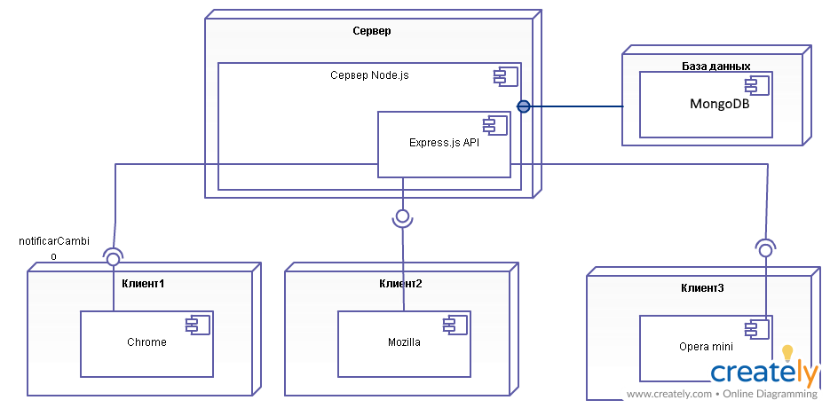

# Содержание
1. [Моделирование динамического поведения системы](#1)  
1.1. [Диаграммы последовательности](#1.1)  
1.2. [Диаграммы активности](#1.2)   
1.3. [Диаграммы состояний](#1.3)  
2. [Моделирование статической структуры системы](#2)  
2.1. [Диаграмма классов](#2.1)  
2.2. [Диаграмма компонентов](#2.2)  
2.3. [Диаграмма развёртывания](#2.3)  

<a name="1"/>

#  1. Моделирование динамического поведения системы

<a name="1.1"/>

##  1.1. Диаграммы последовательности

Формирование заказа пользователем:

Последовательность выполнения поискового запроса:

<a name="1.2"/>

##  1.2. Диаграммы активности

  

  

  

<a name="1.3"/>

##  1.3. Диаграммы состояний

  

#  2. Моделирование статической структуры системы

<a name="2.1"/>

##  2.1. Диаграмма классов

  

<a name="2.2"/>

##  2.2. Диаграмма компонентов

<a name="2.3"/>

##  2.3. Диаграмма развёртывания

